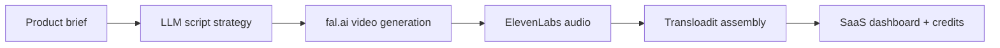

<div align="center">


<br />

<a href="https://www.piyxsh.online">
  
</a>
<a href="https://www.linkedin.com/in/piyush-singh-3698b2fg4/">
  
</a>
<a href="https://x.com/piyxshh">
  
</a>
<a href="mailto:piyxsh.singh@gmail.com">
  
</a>

<br />
<br />


</div>

---

<div align="center">

### I build the layer between a wild AI idea and a real product people can use.

</div>

```ts
const piyush = {
  identity: "Full Stack AI Product Engineer",
  base: "Kolkata, India",
  education: "B.Tech ECE @ Netaji Subhash Engineering College",
  obsession: "AI products that feel useful, fast, and production-shaped",
  currentStack: ["Next.js", "TypeScript", "React", "Node.js", "Python", "PostgreSQL"],
  aiStack: ["LLM agents", "RAG", "OpenAI", "Anthropic", "Gemini", "LangChain", "pgvector"],
  productTaste: ["sharp UX", "admin tooling", "billing logic", "automation", "launch velocity"],
  mode: "shipping ambitious systems before they become obvious"
};
```

---

## Product Systems I Think In

<table>
  <tr>
    <td width="33%">
      <h3>AI Pipelines</h3>
      <p>Multi-model workflows, agent orchestration, RAG, prompt systems, generated media, and evaluation loops.</p>
    </td>
    <td width="33%">
      <h3>SaaS Infrastructure</h3>
      <p>Auth, payments, credits, admin dashboards, storage, databases, APIs, background jobs, and deployment.</p>
    </td>
    <td width="33%">
      <h3>Growth Engines</h3>
      <p>Funnels, onboarding automation, internal tools, user ops, mentor-student matching, and product analytics.</p>
    </td>
  </tr>
</table>

---

## Build Log

### ADVERA

GenAI video ad platform that turns raw product context into polished 60-second ad creatives.



**Core pieces:** OpenAI / Anthropic workflows, fal.ai, ElevenLabs, Transloadit, Stripe, Prisma, PostgreSQL, admin controls.

### Imagine

B2C AI consumer app for photo-to-character transformation, built with monetization and moderation in mind.

**Core pieces:** Gemini Flash, Next.js, Neon PostgreSQL, NextAuth v5, admin dashboard, user tiers, watermarking, AdSense hooks.

### SmartSkale

AI-first learning and consulting website redesign for a live business with active enrollment/payment flows.

**Core pieces:** Vite, React, TypeScript, Tailwind CSS, React Router, Supabase-aware frontend boundaries.

### SYSTEM / systemOS

Personal intelligence and performance OS across web and mobile prototypes.

**Core pieces:** Next.js, Expo, React Native, Supabase auth/data flows, directive cards, logs, chat, health signals.

### JEEV RAKSHAK

Hackathon-winning emergency response platform focused on location-aware safety access and fast alerting.

### SENTINAL

Multi-agent enterprise intelligence platform for competitive analysis, monitoring, synthesis, and strategic reporting.

---

## Experience Snapshot

<table>
  <tr>
    <td><b>Growth Engineer Intern</b><br />InterviewCall / CSForAll</td>
    <td>
      Worked across acquisition, mentor-student communication, retention, and internal tooling for a 500+ user base. Built Python matching logic, a Next.js admin dashboard, and n8n automations across Typeform, Supabase, and PostgreSQL.
    </td>
  </tr>
  <tr>
    <td><b>AI Product Engineer</b><br />Contract Work</td>
    <td>
      Delivered milestone-based AI product builds for UK and US clients, owning architecture across AI pipelines, auth, billing, storage, admin tooling, and deployment.
    </td>
  </tr>
</table>

---

## Arsenal

<div align="center">


<br />
<br />


</div>

---

## GitHub Telemetry

<div align="center">


<br />


<br />


</div>

---

## What I Am Open To

```txt
AI product engineering
Full-stack product builds
GenAI video systems
Agentic workflow products
Startup tooling
Growth engineering
Internships and contract product builds
```

<div align="center">

<a href="https://www.piyxsh.online">
  
</a>
<a href="mailto:piyxsh.singh@gmail.com">
  
</a>

<br />
<br />

<b>Useful products first. Beautiful systems second. Shipping always.</b>

</div>
